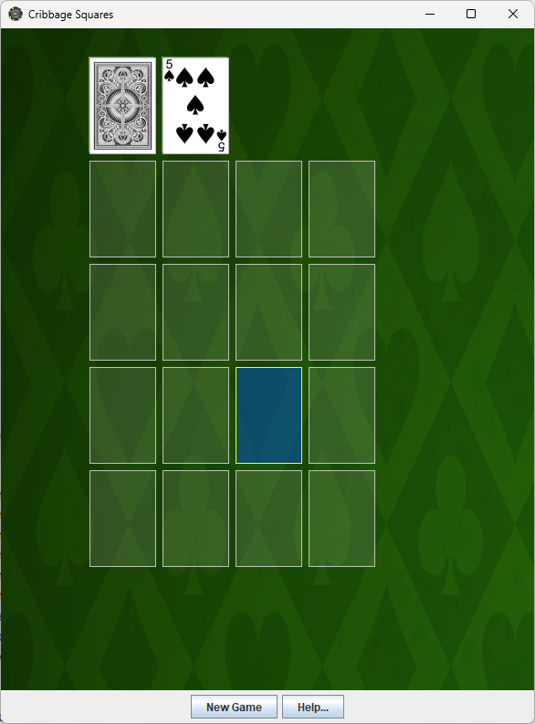
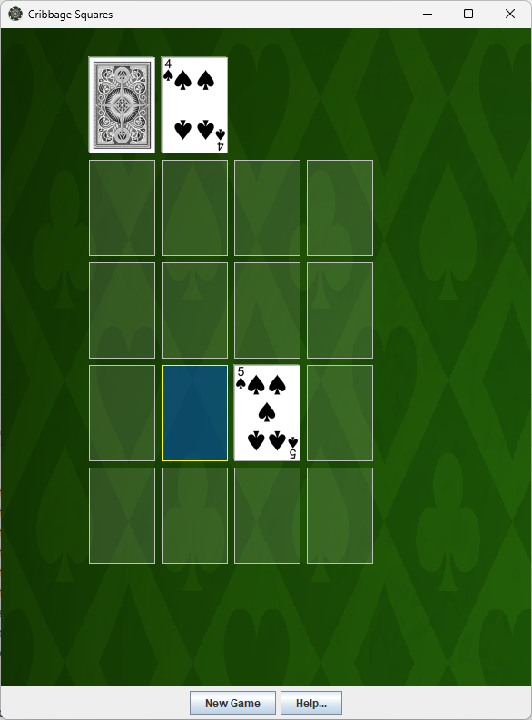
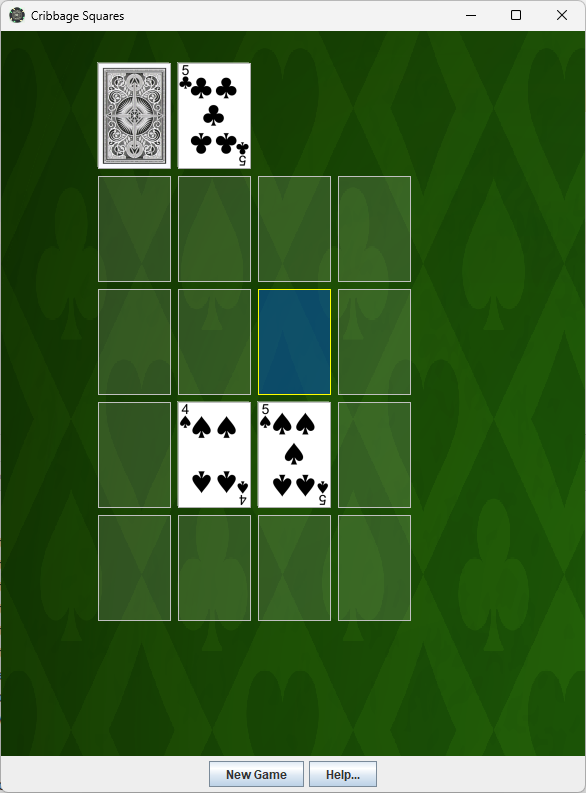
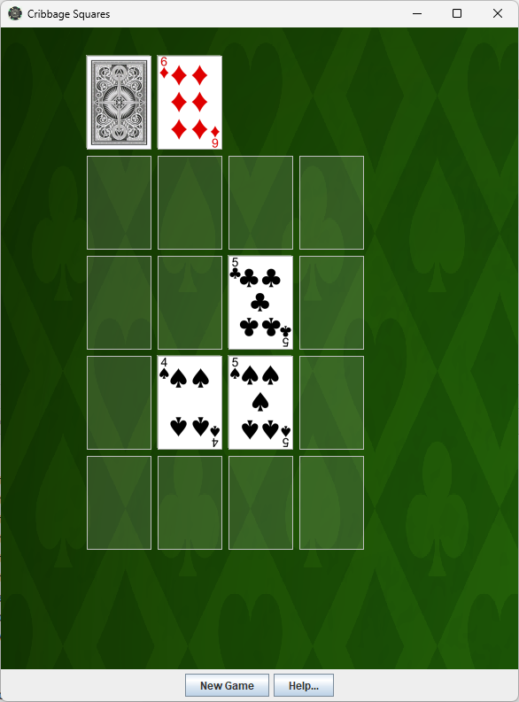
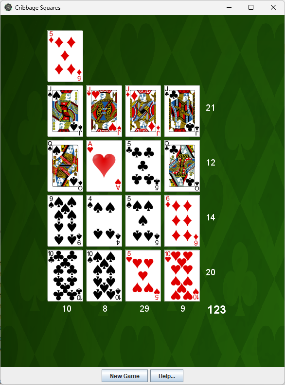

# Cards
An application of card games and simulations.

## Requirements
- [Java 17 or later](https://www.oracle.com/java/technologies/javase/jdk17-archive-downloads.html)
- [Maven 3.x or later](https://maven.apache.org/download.cgi)

## Build
```
mvn package
```

## Run
```
java -jar target\cards-1.0-SNAPSHOT.jar
```

## Cribbage Squares
- Goal: Fill a 4x4 grid to maximize points.  

- Setup: Draw 16 cards from the deck, placing them one by one into a 4x4 grid.  

Play: Each row and column acts as a 4-card hand (plus a shared starter card, drawn 
after the grid is complete). Score each row and column for cribbage combinations. 
Some versions allow a 5th card per row/column as a personal starter for extra challenge.  

- Scoring: Add up points from all eight hands (4 rows + 4 columns). Aim for high totals like 80+.

1. Select New Game to deal first card.
2. Hover mouse over the grid location and click mouse to place the card.
3. Next card is dealt automatically. Repeat step 2 until all cards are dealt.
4. After final card is placed, the starter card will be cut automatically and scores tallied.







